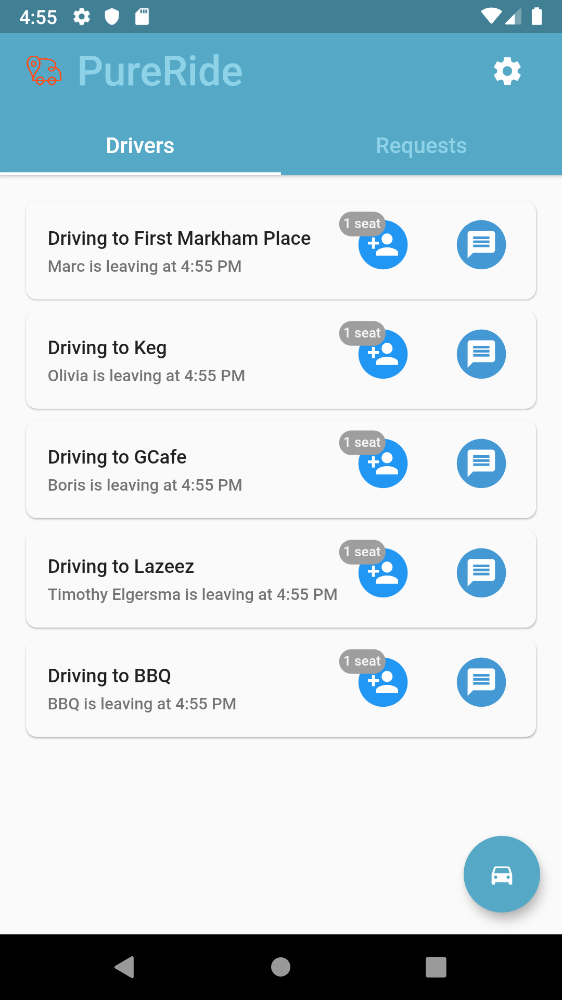

# PureRide

PureRide is a ride-sharing mobile application created from Genesys interal hackathon. The idea stems from being unable to grab food outside the company as a coop who does not own a vehicle. As the team is comprised with mostly coops, we quickly resonate with the idea and want to create an application to connect coop with full-time employees who regularily go out for lunch. This application can extend its usage to organizing ride-sharing for other company's event in additional to lunches!


## Visuals



## Installation

Follow flutter doc to install flutter (https://flutter.dev/docs/get-started/install)

connect with an android device or open an android emulator
```bash
cd [project/pureride]
flutter run
```

